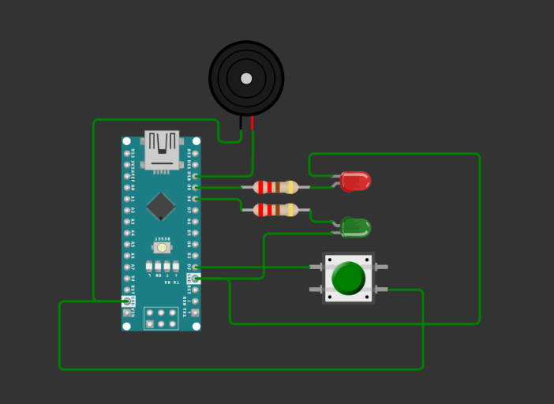
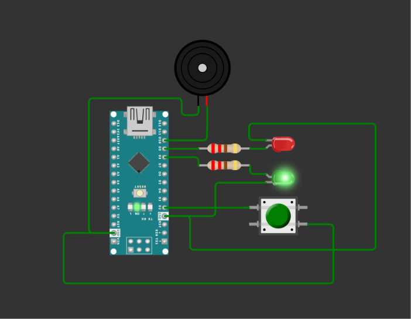
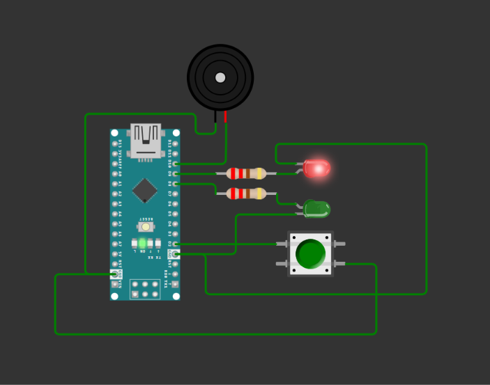

# Embedded Fault Detection System

A simple simulation-based embedded system that detects a simulated fault condition and provides visual and audible alerts using an Arduino Nano.

## Project Status

🟡 **Simulation Prototype**

This project is currently designed and tested in the Wokwi simulation environment.

The push button is used to simulate a fault signal. In a future hardware version, the button can be replaced with a real sensor depending on the type of machine fault being monitored.

---

## Overview

Fault detection systems are used in embedded and industrial applications to identify abnormal conditions and provide immediate alerts.

This project demonstrates a basic fault detection concept using:

- Arduino Nano
- Push button as a simulated fault input
- Green LED for normal condition
- Red LED for fault condition
- Buzzer for audible fault indication

The Arduino continuously reads the push button and changes the system status according to the input.

---

## How Fault Detection Works

The push button acts as a simulated fault signal.

```text
                 Push Button
                     │
                     ▼
               Arduino Nano
                     │
             Read Button State
                     │
              ┌──────┴──────┐
              │             │
           HIGH            LOW
              │             │
              ▼             ▼
           NORMAL          FAULT
              │             │
        🟢 Green LED    🔴 Red LED
           ON              ON
        🔊 Buzzer       🔊 Buzzer
           OFF             ON

```

 Normal Condition
When the button is not pressed:
Button state = HIGH
Green LED = ON
Red LED = OFF
Buzzer = OFF
Fault Condition

When the button is pressed:
Button state = LOW
Green LED = OFF
Red LED = ON
Buzzer = ON

The Arduino uses the internal pull-up resistor with:
                        pinMode(BUTTON_PIN, INPUT_PULLUP);
Therefore, the button reads HIGH normally and LOW when pressed.

## Component

| Component      | Purpose                      |
| -------------- | ---------------------------- |
| Arduino Nano   | Main controller              |
| Push Button    | Simulates fault signal       |
| Green LED      | Indicates normal condition   |
| Red LED        | Indicates fault condition    |
| Buzzer         | Provides audible fault alert |
| 220Ω Resistors | Limit LED current            |

## Pin Configuration

| Component   | Arduino Nano Pin |
| ----------- | ---------------- |
| Push Button | D2               |
| Green LED   | D8               |
| Red LED     | D9               |
| Buzzer      | D10              |

## System Logic
The basic decision logic is:
Button NOT pressed
       ↓
    NORMAL
       ↓
Green LED ON
Red LED OFF
Buzzer OFF


Button PRESSED
       ↓
     FAULT
       ↓
Green LED OFF
Red LED ON
Buzzer ON

## Simulation
The project was developed and tested using Wokwi.

### Circuit




### Normal Condition



### Fault Condition
 
  

## Project Files:-
```text
Embedded_Fault_Detection_System
│
├── Images
│   ├── circuit.png
│   ├── fault-condition.png
│   └── normal-condition.png
│
├── sketch.ino
├── diagram.json
└── wokwi-project.txt
```
## Code Explanation
The program first configures the input and output pins.
pinMode(BUTTON_PIN, INPUT_PULLUP);

pinMode(GREEN_LED, OUTPUT);
pinMode(RED_LED, OUTPUT);
pinMode(BUZZER, OUTPUT);
The Arduino then continuously reads the button:
  int buttonState = digitalRead(BUTTON_PIN);

If the button is pressed, the system enters the fault state:
        if (buttonState == LOW)
{
    digitalWrite(GREEN_LED, LOW);
    digitalWrite(RED_LED, HIGH);
    digitalWrite(BUZZER, HIGH);
}
Otherwise, the system remains in the normal state.

## Current Limitations
The project is currently a Wokwi simulation.
The push button represents a simulated fault signal.
No physical machine is connected.
No real temperature, vibration, current, or voltage sensor is currently used.
The system currently detects only one simulated fault condition.

## Future Improvements:-
The project can be upgraded to a real hardware fault detection system by replacing the push button with appropriate sensors.
Possible improvements include:
🌡️ Temperature sensor for overheating detection
📳 Vibration sensor or accelerometer for abnormal vibration detection
⚡ Current sensor for overcurrent detection
🔌 Voltage monitoring for abnormal voltage conditions
📊 OLED display for real-time machine status
💾 Data logging for fault history
📡 IoT connectivity for remote monitoring
🔔 Improved alarm and notification system
🔧 Real machine hardware testing

## Technologies Used
Arduino Nano
Embedded C / Arduino C++
Wokwi
Digital Input/Output
Internal Pull-Up Resistor
LED Indicators
Buzzer

## Development Stages:-
```text
Stage 1 → Concept Design
          ↓
Stage 2 → Wokwi Circuit Simulation
          ↓
Stage 3 → Fault Detection Logic
          ↓
Stage 4 → Normal/Fault Indicators
          ↓
Stage 5 → GitHub Documentation
          ↓
Future → Real Hardware Implementation
```
## Author
Dharmpal Pawar
Electronics & Telecommunication Engineering Student

NOTE:-

This project is a learning-oriented simulation prototype demonstrating the basic concept of embedded fault detection.
The current implementation uses a push button as a simulated fault input. Real sensor integration is planned as a future hardware upgrade.